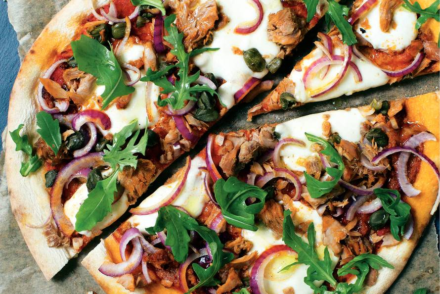

# Junior - Senior pair-up

Welcome everyone!

---

## Most important

|>

Who is gonna stay for some pizza?

---

## What's on the agenda

|>

- Introduction (10 min)

- Pairing part I (45 min)

- Repairing & really small break (10 min)

- Pairing part II (45 min)

- Time for some feedback (untill the pizza arrives)

- Pizza

---

## Why are we here today (except the pizza)

|>

We are going to do an exercise about a supermarket (more info will follow).
It is a chance for juniors to pair with and learn from seniors. The seniors
need to take a coaching role in order for this to work.

Feedback is the most important during and after this pairing session.
This goes both ways. As a junior, do not forget to give some feedback to your pair.

---

## Pairs

|>

Hier komen de pairs.

---

## What is this supermarket exercise you are talking about

|>

On github:
https://github.com/SoftwareSandbox/KataSkeleton

|>

When you are checking out your shopping cart in a supermarket a lot of pricing decisions are made. In this exercise we are going to implement some of those pricing mechanisms.

|>

### Story 1

- Implement a service where you can checkout a list of items. The items shouldn't be unique. This list represents the shopping cart scanning process so no initial grouping/sorting is allowed. The service returns the amount due.

### Story 2

- Some fruits and vegetables don't have a fixed price, but have a price per kg.

|>

### Story 3

- Implement "buy 2 get one for free" this is only on the same item.

### Story 4

- Implement "X kg for X euro" pricing model. This means that if you buy X kg you will get a discount on it, but not on the complete weight.

|>

### Story 5

- Implement large quantities discounts, where you receive a discount when you are buying multiple items of the same type. This can be buy 1 item for 5 euro 2 for 8 and 3 for 9.

### Story 6

- You can have multiple discounts at the same time.

|>

### Story 7

- You should implement an decision log, printing out all the decisions made for the pricing.

### Story 8

- Add a coupon parameter to the method. Some of the coupons can be added with existing discounts other can't. Ensure that we get the best discount (coupon or existing discount).